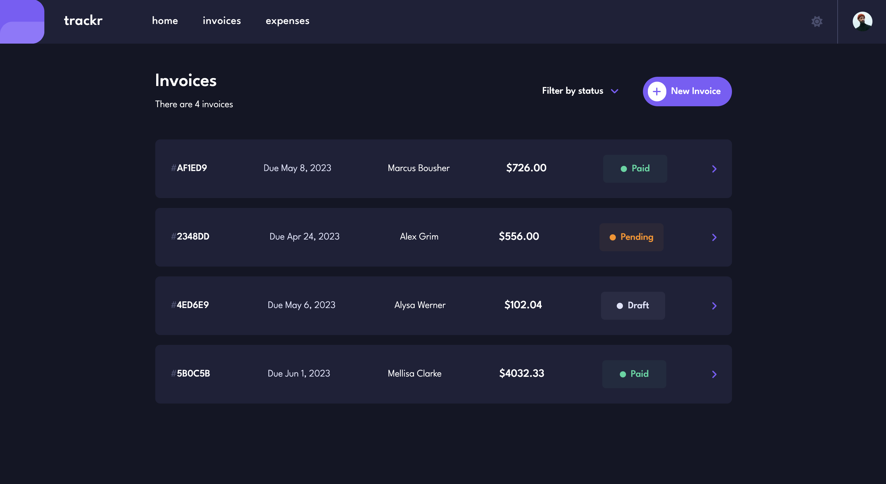

# trackr
Trackr is designed to help users manage their finances with ease. This full-stack app allows users to sign up for an account to create, update, and delete their invoices and expenses, making it simple to keep track of their finances.

## Demo
[Live Demo](https://trackr-nc.vercel.app/)

## Built with
- Next.js
- MongoDB
- Clerk
- TailwindCSS

## Features
- [x] Sign up to create an account with username/email & password, or social connection providers
- [x] Log in to view their account
- [x] Create, read, update, and delete invoices and expenses
- [x] Receive form validations when trying to create/edit an invoice or expense
- [x] Save draft invoices and mark pending invoices or expenses as paid
- [x] Filter invoices or expenses by status (draft, pending, paid)
- [x] Toggle light and dark mode
- [x] Dashboard displays total invoices, expenses, and bar graph to visually represent the total amount for each specific month

## Running this Project Locally
From the repo:
1. Clone this project locally
2. Open the project in your preferred code editor
3. Open your terminal and `cd` to the project directory
4. Run `npm install` to install all relevant dependencies
5. Run `npm run dev` to start a dev server and view the project in your browser

